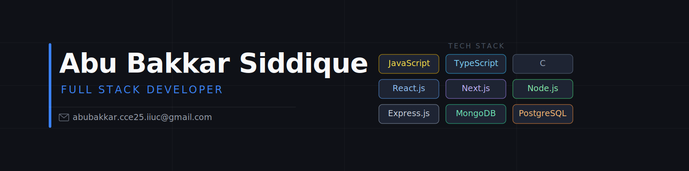

<p align="center">
  
</p>

<p align="center">
  
</p>

<div align="center">
  
  [](https://abubakkar-portfolio-xi.vercel.app)
  [](https://www.linkedin.com/in/abubakkar-dev)
  [](mailto:abubakkar.cce25.iiuc@gmail.com)
  [](https://github.com/AbuBakkarSiddique007)

</div>

---

## 🧑‍💻 About Me

```ts
const abubakkar = {
  degree:    "B.Sc. Computer & Communication Engineering",
  university:"International Islamic University Chittagong (2025)",
  location:  "Chattogram, Bangladesh 🇧🇩",
  role:      "Full Stack Developer",
  focus:     ["Scalable Web Apps", "REST APIs", "Clean Architecture"],
  openTo:    ["Full Stack", "Frontend", "Backend Roles"],
  contact:   "abubakkar.cce25.iiuc@gmail.com",
};
```

---

## 🛠️ Tech Stack

<div align="center">

**🌐 Languages**


**⚛️ Frontend**


**🔧 Backend & Database**


**☁️ Tools & Platforms**


</div>

---

## 📊 GitHub Stats

<div align="center">
  
  
</div>

<div align="center">
  
</div>

<div align="center">
  
</div>

---

## 🚀 Featured Projects

<div align="center">

| 🏷️ Project | 📝 Description | ⚡ Stack | 🔗 Links |
|:---:|:---|:---:|:---:|
| **DevHuntr** | Community marketplace for developer tools. Stripe subscriptions, role-based dashboards & JWT auth. | Next.js · Express · PostgreSQL · Prisma · Stripe | [🌐 Live](https://devhuntrclient.vercel.app) [💻 Client](https://github.com/AbuBakkarSiddique007/DevHuntr_Client) [🔧 Server](https://github.com/AbuBakkarSiddique007/DevHuntr_Server) |
| **BhojonBox** | Full-stack food ordering platform with provider & admin role dashboards. | Next.js · Node.js · PostgreSQL · Prisma · JWT | [🌐 Live](https://bhojonbox-client.vercel.app) [💻 Client](https://github.com/AbuBakkarSiddique007/bhojonbox_client) [🔧 Server](https://github.com/AbuBakkarSiddique007/bhojonbox_server) |
| **ShareStep** | Volunteer management platform with request handling & secure role-based access. | React · Node.js · MongoDB · Firebase · JWT | [🌐 Live](https://sharestep-d09c3.web.app) [💻 Client](https://github.com/AbuBakkarSiddique007/ShareStep-Client) [🔧 Server](https://github.com/AbuBakkarSiddique007/ShareStep-Server) |

</div>

---

<p align="center">
  
</p>
